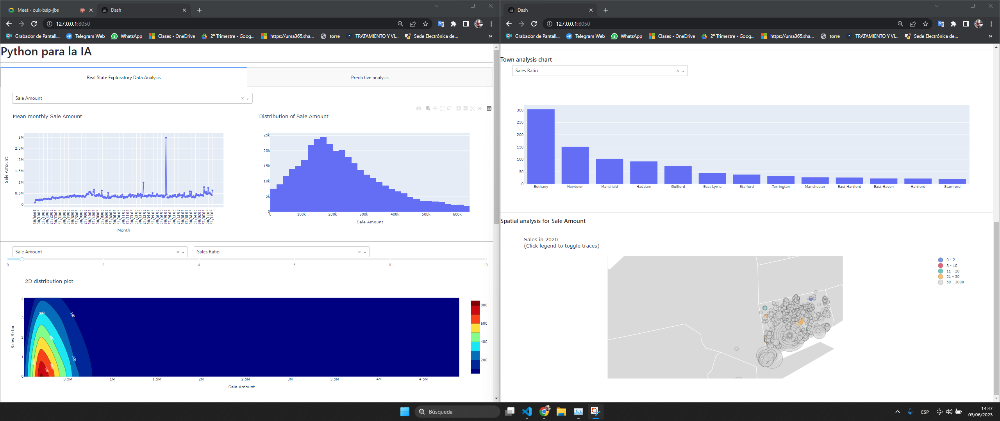

# 01MIAR_trabajo_final
Trabajo final para la asignatura 01 Python para la Inteligencia Artificial del Máster Universitario en Inteligencia Artificial


## Notebooks de analisis, data cleansing y regresión
### Análisis de los datos, acondicionamiento y primera aproximación de modelo predictivo
- [20230524_Real_State.ipynb](Analisis\20230524_Real_State.ipynb)
- [Importar_archivos_de_location.ipynb](Analisis\Importar_archivos_de_location.ipynb)

### Análisis previo para visualización con Plotly y modelo predictivo mejorado con XGBoost
- [notebook.ipynb](notebook.ipynb)

### Aplicación usando Plotly con módulo de visión geoespacial
- [app.py](app.py)
- [index.py](index.py)
- [layout.py](layout.py)
- [utils](\utils)
    - [data_cleaning_utils.py](utils\data_cleaning_utils.py)
    - [machine_learning_utils.py](utils\machine_learning_utils.py)
    - [plot_utils.py](utils\plot_utils.py)

<br>



## Uso de la aplicación
```bash
$ python index.py # lanzamiento de la aplicación
```

## Notas
- No nos ha dado tiempo a integrar en la aplicación el modelo predictivo que se explica en los notebooks.